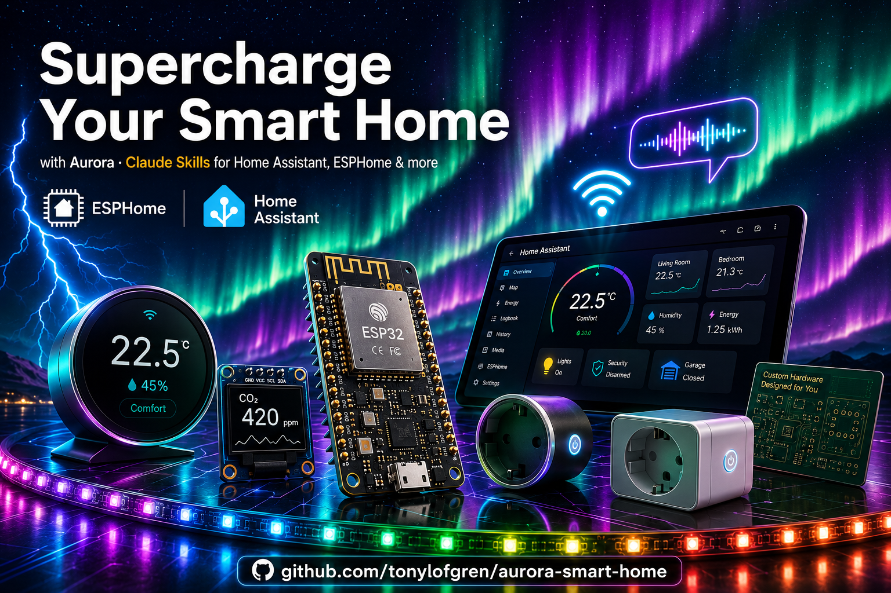

<p align="center">
  
</p>

# Aurora Smart Home

> **75,000+ lines** of documentation | **900+ example prompts** | **1,500+ code examples**

The most comprehensive Claude Code skill pack for smart home development - from YAML automations to designing and manufacturing professional ESPHome-based IoT products.

[](https://docs.anthropic.com/en/docs/claude-code)
[](https://www.home-assistant.io/)
[](https://esphome.io/)
[](LICENSE)

---

## At a Glance

|  | Home Assistant | Node-RED | ESPHome | Integration Dev |
|---|:---:|:---:|:---:|:---:|
| **Reference Guides** | 49 | 12 | 38 | 17 |
| **Example Prompts** | 300+ | 100+ | 600+ | 129 |
| **Code Examples** | 700+ | 200+ | 1000+ | 200+ |
| **Ready Templates** | 17 | 15 | 30 | 10 |
| **Coverage** | 50+ integrations | 31 nodes | 160+ components | Full HA framework |
| **Bonus** | Sections dashboard | Node-RED 4.x | **Product dev: idea → production** | HACS v2 |

---

> **v1.3.0 - Reinstall recommended:**
> Individual skill commands (`/aurora:ha-yaml`, `/aurora:esphome`, etc.) have been replaced by the `/aurora` orchestrator. Run `/plugin marketplace add tonylofgren/aurora-smart-home` then `/plugin install aurora@aurora-smart-home` to update.

### What's New in v1.3.0

#### Aurora - A New Way to Work

Start with `/aurora` — Aurora opens, asks what you want to build, and takes it from there.

No need to know which skill to use. Describe your project in plain language and Aurora routes to the right specialist(s), recommends the right Claude model for your subscription tier, and builds a step-by-step workflow if the task spans multiple skills.

**19 specialist agents** — Volt (ESP32 firmware), Sage (automations), Ada (custom integrations), Iris (dashboards), Glitch (debugging), Grid (network/VLANs), Forge (infrastructure), and 12 more. Each agent has a defined domain, a soul, and a voice.

#### Home Assistant 2026.4

- **IR Proxy** — Native infrared entity platform. ESPHome IR devices expose `InfraredEntity`, HA sends commands through them
- **Cross-domain automation triggers** — More intuitive trigger syntax aligned to how people think (Labs)
- **Matter lock PIN management** — Full PIN code control for Matter locks
- **Dashboard** — Section background colors and card favorites
- **Voice** — Ask Assist to clean a specific room area
- **New integrations** — UniFi Access, WiiM, Solarman, TRMNL (e-paper display)

#### ESPHome 2026.3

- **IR/RF Proxy** (`ir_rf_proxy`) — Runtime IR/RF without reflashing. Learns and replays commands via `remote_transmitter` / `remote_receiver`
- **RP2040/RP2350** — First-class Raspberry Pi Pico support (143+ boards, WiFi, BLE, OTA)
- **Media Player redesign** — Pluggable sources, playlists, Ogg Opus support
- **Performance** — Main loop up to 99x faster, API protobuf 6-12x faster, 11-20KB flash savings. Just reflash — no config changes needed
- **ESP8266 heap crash fix** — Long-standing LWIP use-after-free bug resolved
- **Alarm Control Panel**, **Lock & Valve**, **MIPI DSI displays**, **Z-Wave Proxy**, **Zigbee expansion**

See [CHANGELOG.md](CHANGELOG.md) for full details.

---

## Choosing the Right Skill

| I want to... | Use this skill |
|--------------|----------------|
| Create **YAML automations** (automations.yaml, blueprints, dashboards) | `ha-yaml` |
| Build **visual Node-RED flows** (drag-and-drop, JSON) | `node-red` |
| Configure **ESP device firmware** or **design a new IoT product** | `esphome` |
| Develop **Python custom components** (HACS) | `ha-integration` |

> **Tip:** If your request is ambiguous (e.g., "make a motion light"), the skill will ask which platform you prefer.

---

## Quick Start

```bash
# 1. Add the marketplace
/plugin marketplace add tonylofgren/aurora-smart-home

# 2. Install all skills
/plugin install aurora@aurora-smart-home
/plugin install ha-yaml@aurora-smart-home
/plugin install esphome@aurora-smart-home
/plugin install node-red@aurora-smart-home
/plugin install ha-integration@aurora-smart-home
```

That's it - skills are now available in all your projects.

<details>
<summary><strong>Advanced: install per-project or per-team instead</strong></summary>

By default, skills install globally (`--scope user`). You can also scope them:

```bash
# Shared with your team via git (committed to .claude/settings.json)
/plugin install ha-yaml@aurora-smart-home --scope project

# Only for you in this project (gitignored, .claude/settings.local.json)
/plugin install ha-yaml@aurora-smart-home --scope local
```

| Scope | Stored in | Shared? | Use when |
|-------|-----------|---------|----------|
| `user` (default) | `~/.claude/settings.json` | No | Personal use across all projects |
| `project` | `.claude/settings.json` | Yes, via git | Team wants same skills |
| `local` | `.claude/settings.local.json` | No (gitignored) | Testing, personal project config |

</details>

---

## How Skills Activate

Skills activate in two ways:

### 1. Automatic (Contextual)

Just mention keywords naturally - skills load automatically:

| Skill | Triggers on |
|-------|-------------|
| `node-red` | "node-red" anywhere (even "node-redflöde", "Node-RED-flow") |
| `esphome` | "ESPHome", "ESP32", "ESP8266", device firmware |
| `ha-yaml` | "YAML automation", "blueprint", "automations.yaml" |
| `ha-integration` | "custom integration", "HACS", "custom_components" |

> **Language-independent:** Product names like "Node-RED" and "ESPHome" work in any language.

### 2. Explicit (Slash Command)

Use `/aurora` when you're not sure which skill fits, or when your task spans multiple skills:

```
/aurora
```

Aurora asks what you want to build and routes to the right specialist.

---

## Getting Started with Your First Project

After installation, be explicit about which platform you want. Examples:

```
💬 "Create an ESPHome config for an ESP32 temperature sensor with OLED display"
   → ESPHome skill activates, asks about board, generates complete config

💬 "Create a Home Assistant automation that turns on lights at sunset"
   → HA-YAML skill activates, clarifies format, creates YAML automation

💬 "Create a Node-RED flow for motion-activated lights"
   → Node-RED skill activates, generates importable JSON flow

💬 "Create a Python custom integration for the Acme cloud API"
   → HA-Integration skill activates, guides through architecture
```

### Example Projects

The `examples/` folder contains complete, working projects:

| Example | Description |
|---------|-------------|
| [complete-smart-room](./examples/complete-smart-room/) | Full room with sensors, voice control, automations |
| [smart-greenhouse](./examples/smart-greenhouse/) | Automated irrigation, climate monitoring, grow lights |
| [smart-garage](./examples/smart-garage/) | Garage door control, car detection, safety features |
| [energy-monitor](./examples/energy-monitor/) | CT clamp power monitoring, cost tracking, alerts |

### How Skills Work Together

See [SKILL-INTEGRATION.md](./SKILL-INTEGRATION.md) for detailed workflows showing how ESPHome → HA Integration → HA Automation skills connect.

---

## What's Included

### Home Assistant YAML Skill (`ha-yaml`)

Create **YAML-based automations**, scripts, blueprints, templates, and dashboards.

| Feature | Count |
|---------|-------|
| Reference guides | 49 |
| Example prompts | 300+ |
| YAML code examples | 700+ |
| Production-ready templates | 17 |
| Integrations covered | 50+ |

**Covers:** Automations, scripts, blueprints, template sensors, Sections dashboards, Mushroom cards, Jinja2, helpers, packages, presence detection, voice Assist, calendar automations, notification patterns, energy monitoring. Integrations: MQTT, Zigbee2MQTT, ZHA, Z-Wave, Matter, Bluetooth, Frigate, Tuya, Shelly, Tasmota, and more. Uses modern HA 2024.8+ syntax (`action:`, plural keys, `template:` integration).

[View Home Assistant documentation](./home-assistant/README.md)

---

### Node-RED Skill (`node-red`)

Build **visual automation flows** using node-red-contrib-home-assistant-websocket v0.80+ on Node-RED 4.x.

| Feature | Count |
|---------|-------|
| Reference guides | 12 |
| Example prompts | 100+ |
| Flow examples | 200+ |
| Ready-to-import templates | 15 |
| Nodes covered | 31 |

**Covers:** trigger-state, api-call-service, current-state, events, number/select/text/time-entity nodes, function nodes, context storage, timer patterns, error handling, subflows, JSONata, MQTT integration, and state machines.

[View Node-RED documentation](./node-red/README.md)

---

### ESPHome Skill (`esphome`)

Configure **ESP device firmware** and **design new IoT products** - from sensor configs to production-ready hardware.

| Feature | Count |
|---------|-------|
| Reference guides | 28 |
| Project prompts | 600+ |
| Configuration examples | 1000+ |
| Device templates | 27 |
| Components covered | 160+ |

**Component categories:**

| Category | Examples |
|----------|---------|
| Sensors | Temperature, humidity, pressure, CO2, VOC, PM2.5, light, UV, distance, weight |
| Presence | PIR, mmWave radar (LD2410/2450), BLE tracking, Doppler |
| Displays | OLED, e-ink, TFT, LVGL, HUB75 LED matrix, LCD |
| Lighting | LED strips (WS2812, SK6812), PWM dimmers, RGBW, effects |
| Climate | HVAC, thermostats, fans, covers, motorized blinds |
| Audio | I2S microphone, speaker, media player, voice assistant |
| Communication | I2C, SPI, UART, CAN bus, RS485, IR/RF remote, BLE, Zigbee, Thread, Matter |
| Power | Energy monitoring (CT clamp, HLW8012), battery management, solar |
| Motors | Stepper, servo, DC motor, H-bridge drivers |
| Devices | Shelly, Sonoff, Tuya, commercial device conversions |

**Product development:** Hardware selection with live pricing, KiCad PCB design, 3D-printed enclosures, CE/FCC certification, BOM optimization, and manufacturing from prototype to production.

**Platforms:** ESP32, ESP32-S3, ESP32-C3, ESP32-C6, ESP32-H2, ESP32-P4, ESP8266, RP2040, nRF52, LibreTiny

[View ESPHome documentation](./esphome/README.md)

---

### Integration Development Skill (`ha-integration`)

Develop **Python custom components** for Home Assistant (custom_components, HACS).

| Feature | Count |
|---------|-------|
| Reference guides | 17 |
| Development prompts | 129 |
| Code examples | 200+ |
| Starter templates | 10 |

**Covers:** Typed ConfigEntry with `runtime_data`, DataUpdateCoordinator, config flows (setup, reauth, reconfigure, subentries), entity platforms (20+), EntityDescription (`frozen=True`), action responses (`SupportsResponse`), repair issues, diagnostics, device registry, OAuth2, conversation agents, AI Task entities, Integration Quality Scale, HACS v2 publishing.

**Templates:** Basic, polling, push, OAuth2, multi-device hub, service, Bluetooth, conversation agent, media player, webhook.

[View Integration Dev documentation](./ha-integration-dev/README.md)

---

## Why This Skill Pack?

- **Saves hours** - No more searching through docs and forums
- **Always current** - Covers HA 2024.x-2026.x, ESPHome 2026.3, Node-RED 4.x
- **Copy-paste ready** - 54 templates you can use immediately
- **Battle-tested patterns** - Based on community best practices
- **Complete coverage** - From beginner to advanced use cases

<details>
<summary><strong>Full Capability Map - everything these skills can do</strong></summary>

### Home Assistant YAML

| Capability | Details |
|-----------|---------|
| Automations | Triggers, conditions, actions, multi-trigger, `choose`, `if/then`, parallel |
| Blueprints | Inputs, selectors, domain filtering, shareable templates |
| Scripts | Sequences, variables, response data, rate limiting |
| Scenes | State snapshots, transition control |
| Template sensors | Trigger-based, time-based, aggregation, statistics |
| Dashboards | Sections view, Tile cards, Mushroom cards, energy, climate, security |
| Voice Assist | Custom sentences, intent scripts, Speech-to-Phrase, multi-wake word |
| Helpers | Input boolean/number/select/text/datetime, counters, timers, groups |
| Packages | Split config by room/function, includes |
| Presence | Device tracker, zones, person, BLE, GPS |
| Notifications | Actionable, images, TTS, persistent, priority routing |
| Calendar | Schedule automations from HA calendar |
| Energy | Utility meter, cost tracking, solar, EV charging |
| Modern syntax | `action:` (not `service:`), plural keys, `template:` integration |
| Integrations | MQTT, Zigbee2MQTT, ZHA, Z-Wave, Matter, Bluetooth, Frigate, Shelly, Tuya, Tasmota |

### ESPHome - Device Configuration

| Capability | Details |
|-----------|---------|
| 10 platforms | ESP32, S3, C3, C6, H2, P4, ESP8266, RP2040, nRF52, LibreTiny |
| Sensors (50+) | Temperature, humidity, pressure, CO2, VOC, PM2.5, light, UV, distance, weight, power |
| Presence | PIR (HC-SR501, AM312), mmWave (LD2410, LD2450), BLE tracking, Doppler |
| Displays | OLED (SSD1306), e-ink, TFT (ILI9341), LVGL graphics, HUB75 LED matrix |
| Lighting | WS2812B, SK6812, PWM, RGBW, addressable effects, color temperature |
| Audio/Voice | I2S mic/speaker, media player, Micro Wake Word, Assist satellite |
| Protocols | WiFi, BLE, Zigbee, Thread, Matter, I2C, SPI, UART, CAN bus, RS485, IR, RF 433MHz |
| Climate | PID thermostat, bang-bang, fan speed, cover position, motorized blinds |
| Power | CT clamp, HLW8012, PZEM, INA219, battery level, solar charge |
| OTA | Local, HA-managed (dashboard_import), HTTP self-update, fleet management |
| Devices | Shelly, Sonoff, Tuya conversion, Arduino migration |

### ESPHome - Product Development

| Capability | Details |
|-----------|---------|
| Hardware selection | MCU comparison, 60+ sensors with prices and I2C addresses, live price lookup |
| Power design | USB-C, LiPo battery (TP4056), solar, PoE, mains (Hi-Link modules) |
| PCB design | KiCad workflow, schematic checklist, layout rules, antenna clearance |
| Enclosures | 3D printing (FDM/SLA materials), IP ratings, off-the-shelf options |
| Prototyping | Breadboard → perfboard → custom PCB progression |
| Production firmware | `project:` block, `dashboard_import:`, WiFi provisioning, fallback AP |
| Fleet OTA | GitHub-hosted updates, self-hosted HTTP OTA, ESPHome Dashboard |
| Certification | CE/FCC/RoHS, pre-certified module strategy, cost reduction tips |
| Manufacturing | JLCPCB/PCBWay SMT assembly, test jig design, QC process |
| Cost estimation | BOM template, volume pricing, retail price calculation |
| Component sourcing | LCSC, Mouser, DigiKey, JLCPCB parts, AliExpress |

### Node-RED

| Capability | Details |
|-----------|---------|
| HA nodes | trigger-state, api-call-service, current-state, events, poll-state |
| Entity nodes | number, select, text, time-entity (stable since v0.71) |
| Flow patterns | Motion lights, presence detection, notifications, climate, media |
| Function nodes | JavaScript, async patterns, `node.send()`/`node.done()`, global context |
| State machines | Context storage, flow/global scope, persistence |
| Error handling | Catch nodes, retry patterns, scoped error handling |
| Advanced | Subflows, JSONata, MQTT, HTTP requests, timer with extend |
| Compatibility | Node-RED 4.x, Node.js 18+, HA websocket v0.80+ |

### Integration Development (Python)

| Capability | Details |
|-----------|---------|
| Architecture | Typed `ConfigEntry[T]`, `runtime_data`, platform forwarding |
| Config flows | Setup, reauth, reconfigure, options, subentries |
| Data fetching | DataUpdateCoordinator with `_async_setup`, `config_entry` arg, `always_update` |
| Entities (20+) | Sensor, binary sensor, switch, light, climate, cover, fan, media player, camera, etc. |
| EntityDescription | `frozen=True`, `kw_only=True`, custom value functions |
| Actions | `SupportsResponse`, `response_variable`, schema validation |
| AI/Voice | ConversationEntity, LLM API, AI Task entity, subentry-based config |
| Device registry | DeviceInfo, connections, identifiers, configuration URL |
| Repair issues | `async_create_issue`, fixable repairs, RepairsFlow |
| Diagnostics | Config entry + device diagnostics, sensitive data redaction |
| Security | HTTPS enforcement, input validation, credential handling, rate limiting |
| OAuth2 | Token refresh, `OAuth2TokenRequestReauthError`, application credentials |
| Testing | pytest-homeassistant-custom-component, MockConfigEntry, fixtures |
| Publishing | HACS v2, manifest.json, CI validation, GitHub topics, Quality Scale |
| Templates | 10 starter templates (basic, polling, push, OAuth2, hub, BLE, voice, etc.) |

</details>

---

## Installation

See individual skill READMEs for detailed installation and usage:
- [Home Assistant Installation](./home-assistant/INSTALLATION.md)
- [ESPHome Installation](./esphome/INSTALLATION.md)

## Update & Uninstall

```bash
# Update a skill
/plugin update ha-yaml@aurora-smart-home
/plugin update node-red@aurora-smart-home
/plugin update esphome@aurora-smart-home
/plugin update ha-integration@aurora-smart-home

# Uninstall a skill (use interactive UI - see note below)
/plugin uninstall ha-yaml@aurora-smart-home
/plugin uninstall node-red@aurora-smart-home
/plugin uninstall esphome@aurora-smart-home
/plugin uninstall ha-integration@aurora-smart-home
```

---

## Enable Auto-Update

Auto-update keeps your skills current automatically.

1. Run `/plugin` to open the plugin manager
2. Go to **Marketplaces** tab
3. Select `aurora-smart-home`
4. Choose **Enable auto-update**

Skills will update automatically when Claude Code starts.

---

## Change Installation Scope

To move a plugin from one scope to another (e.g., user → local):

1. Run `/plugin` to open the plugin manager
2. Go to **Installed** tab
3. Select the plugin and choose **Uninstall**
4. Reinstall with new scope:
   ```bash
   /plugin install ha-yaml@aurora-smart-home --scope local
   ```

**Note:** Use the interactive UI to uninstall - the CLI command `/plugin uninstall` only disables plugins.

---

## Troubleshooting

Having issues? Check the [Troubleshooting Guide](./TROUBLESHOOTING.md) for common problems and solutions across all skills.

---

## Changelog

See [CHANGELOG.md](./CHANGELOG.md) for version history and recent updates.

---

## Contributing

Contributions are welcome! Please feel free to submit issues or pull requests.

## License

MIT License - see [LICENSE](LICENSE) for details.

---

## Credits

Aurora's agent personas are inspired by the people building the Open Home.

| Agent | Inspired by |
|-------|-------------|
| **Aurora** | Otto Privacyhaus — believes your home should work without asking the cloud for permission. |
| **Ada** + **Lens** | Hendrik Nomerge — your PR is not ready. He knows. He will tell you. |
| **Atlas** | Lars Hacsworth — built the store everyone uses to share their builds. |
| **Iris** + **Lore** | Penelope Crowwhisperer — tamer of crows. Bridge between humans and their smart homes. |
| **Mira** | François Backlogeau — has opinions about roadmaps. Very French ones. |

---

Every release, every fix, every new integration — funded by Nabu Casa. If your home runs on HA, consider giving back. [nabucasa.com](https://www.nabucasa.com)

*Community project. Not affiliated with or endorsed by Nabu Casa or the Open Home Foundation. Agent personas are fictional.*

---

Created for use with [Claude Code](https://docs.anthropic.com/en/docs/claude-code) by Anthropic.
