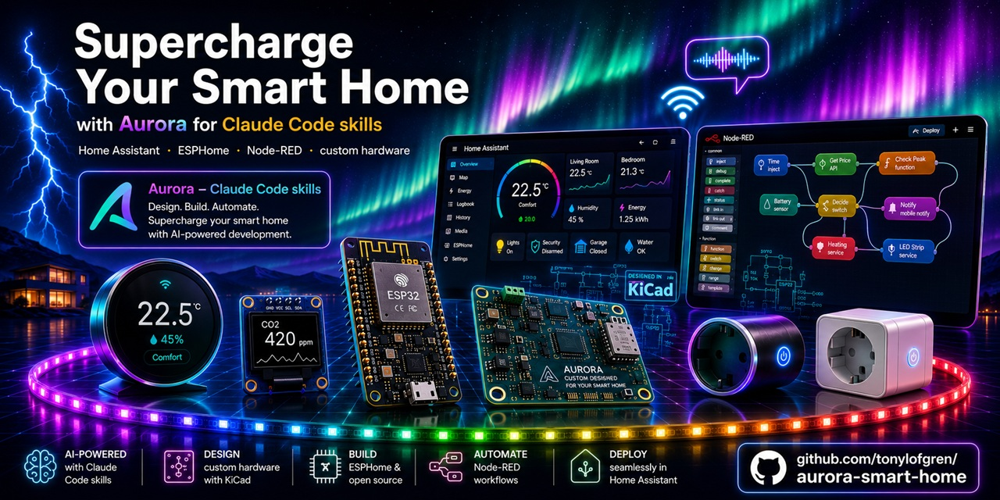

<p align="center">
  
</p>

# Aurora Smart Home

A Claude Code plugin for building smart home projects with verified reference data.
Aurora routes your request to a specialist, validates every pin, entity, and address
against schema-checked profiles, and refuses to ship code that does not pass.

[](https://docs.anthropic.com/en/docs/claude-code)
[](https://www.home-assistant.io/)
[](https://esphome.io/)
[](CHANGELOG.md)
[](aurora/references/)
[](LICENSE)
[](https://www.nabucasa.com)

---

> ⚠️ **Use at your own risk.** Aurora generates code and recommendations for
> educational purposes. Smart home projects involve mains electricity, batteries,
> and devices that control locks, water, heating, and gas. AI-generated configs
> can be plausible but wrong. The maintainers, contributors, and Anthropic accept
> no liability for property damage, personal injury, data loss, or any other harm.
> See [DISCLAIMER.md](DISCLAIMER.md) for full terms.

---

## What's new: ESPHome 2026.6.0 support (v1.15.0, June 2026)

- **New ESPHome release reference:** Aurora now knows ESPHome 2026.6.0, with an upgrade checklist, breaking changes, and copy-ready examples, so generated firmware matches the current release instead of older patterns.
- **New hardware covered:** the motion/IMU framework (BMI270 and LSM6DS tilt and orientation), the PCM5122 HiFi audio DAC, the router speaker for live SPDIF/analog switching, the XDB401 pressure sensor, and FTDI/Prolific USB-serial adapters, each with a worked config.
- **Safer upgrades:** Aurora warns that ESP8266 now defaults to WPA2 (legacy routers need a one-line opt-out) and shows how `enable_on_boot: false` now frees real RAM on WiFi and ethernet.

## What's new: two new recipes and four more sensors (v1.14.0, June 2026)

- **Two new recipes:** `daylight-lights` dims or switches lights to match the measured ambient light in a room, and `dc-power-monitor` measures the current and power a DC device or circuit draws. The library is now 14 curated starting points.
- **Four more verified sensors** in the catalog (now 14 parts): SHT31 and AHT20 (higher-accuracy temperature/humidity), BH1750 (ambient light), and INA219 (DC current/power), each with a real, in-stock JLCPCB part number.
- **Sharper existing recipes:** weather-station can swap in SHT31/AHT20 for better accuracy, and motion-light now has a real light sensor (BH1750) behind its lux threshold.

## What's new: out-of-stock warnings (v1.13.1, June 2026)

- **No more checkout surprises:** when a part you picked is out of stock or running low at JLCPCB, Aurora now flags it in the BOM and calls it out in the README, so you can swap to an alternative before you order instead of finding out at checkout.
- **Live stock in the component catalog:** the verified-parts catalog tracks JLCPCB stock status (in stock / low / out of stock), refreshed automatically each month.

## What's new: stronger delivery and protocol checks (v1.13.0, June 2026)

Three additive upgrades that make Aurora's output more trustworthy.

- **Conformance levels in the delivery check:** `check-delivery.py` now reports whether a project reaches minimal, standard, or strict, and you can gate at the level you want. The language check is now definitive (every doc in a project must share one language) instead of a heuristic, and there is a drop-in CI workflow template so you can gate your own project repos.
- **A worked DEEP-mode demo:** a complete CO2 project shows three specialists (firmware, automation, dashboard) building through one shared snapshot, with a replay test that proves the hand-off protocol end to end.
- **An eval regression gate:** the routing and delivery eval scores are pinned to a golden baseline, so a future change cannot quietly weaken how Aurora routes requests or what it delivers.

## What's new: recipe library (v1.12.0, June 2026)

Aurora can now start you from a curated recipe instead of a blank page.

- **12 ready-made starting points:** CO2 monitor, motion light, weather station, fridge/freezer monitor, room presence, home/away routine, energy dashboard, notification hub, vacation mode, greenhouse, smart thermostat, and a button scene controller.
- **Describe a goal, get suggestions:** say something broad like "I want to do something about air quality" and Aurora offers the closest recipes, always with "start from scratch" as an option.
- **Pick one and Aurora builds it:** the full project folder is generated from the recipe (hardware with verified part numbers where applicable, automation pattern, and dashboard), then you customise the handful of parameters that matter (thresholds, rooms, schedules).
- **Across the board:** recipes span sensor builds and pure Home Assistant automations that need no new hardware, and each links the full worked example when one exists.

## What's new: verified part numbers + validated netlists (v1.11.0, June 2026)

The fab-ready pipeline from v1.10.0 is now complete and verified end to end.

- **Real JLCPCB part numbers:** 9 of 10 sensor profiles carry LCSC numbers verified live against the JLCPCB parts catalog, and a monthly sync keeps their library status current. Hardware projects get orderable BOMs instead of placeholders.
- **Machine-validated netlists:** every custom-PCB delivery now runs `validate_schematic.py`, which catches shorts (one pin in two nets), undeclared components, duplicate nets, and missing ground before anything reaches a fab. The OpenSCAD enclosure template is render-verified to produce a printable, manifold STL.
- **Current ESPHome syntax:** all ESPHome examples and references use the actions terminology (`api: actions:`, `homeassistant.action`) that ESPHome adopted in line with Home Assistant. Old configs keep working; new output follows the current docs.
- **Smarter multi-agent builds:** the debugging, QA, review, and documentation specialists now coordinate through the shared project snapshot, so a debugging pass mid-project sees the real board, pins, and entity IDs instead of guessing from conversation history.

## What's new: fab-ready hardware delivery (v1.10.0, June 2026)

Hardware projects can now go from idea to a PCB order without leaving Aurora.

- **Machine-readable manufacturing exports:** custom-PCB and production projects ship `hardware/schematic.json` (a netlist you can tick off while redrawing in KiCad) and `hardware/BOM.csv` in the exact column format JLCPCB assembly expects. Part numbers are never invented; `TBD` marks parts still waiting for sourcing.
- **Printable enclosures:** a parametric OpenSCAD template generates a two-part box with PCB standoffs, ventilation slots, cable opening, and an optional sensor window, sized from your board dimensions.
- **Safer and smarter orchestration:** projects involving batteries, mains power, actuators, water, or outdoor mounting now always start with a hazard analysis before any firmware is generated, and requests that span several specialists are routed with clear tiebreaker rules.

## What's new: modern syntax everywhere + 4 new references (v1.9.3, June 2026)

Every YAML example in the entire plugin now uses current Home Assistant syntax.

- **Modern syntax everywhere:** all references, starter templates, dashboards, and the 27 complete examples now use `triggers:`, `conditions:`, `actions:`, `action:` calls, and `perform-action` dashboard taps. The migration guide documents the 2024.8 and 2024.10 renames with before/after examples, so older configs are easy to bring forward.
- **Four new reference files:** ESPHome `packages:` for modular fleet configs (20-line device files), reusable Jinja2 macros via `custom_templates/`, HA labels and categories for organizing large installs, and Node-RED Dashboard 2.0 for building web panels.
- **Deeper troubleshooting:** automation debugging with traces (opening them, common findings, a "my automation did not run" flowchart) and git-based Node-RED Projects for versioning flows.

## What's new: HA reference refresh (v1.9.2, May 2026)

The Home Assistant YAML skill's reference library has been brought up to date against the official HA documentation snapshot from 2026-05-30.

- **Dashboard actions** — the `actions.md` reference now covers all seven Lovelace tap/hold/double-tap action types (`more-info`, `toggle`, `perform-action`, `navigate`, `url`, `assist`, `none`) including confirmation dialogs. Also added: response variables for capturing return data from calendar, weather, and other actions that produce structured output.
- **Device-specific conditions and triggers** — `conditions.md` gained a Device-Specific Conditions section covering alarm, climate, timer, calendar (`calendar.is_event_active`), and more, plus a selection guide. `triggers-advanced.md` gained a Device Trigger Inventory spanning 18+ device domains and a dedicated Calendar Trigger section.
- **Modern syntax throughout** — deprecated `service:`, `platform:`, and singular automation keys (`trigger:`, `condition:`, `action:`) replaced with `action:`, `trigger: state`, `triggers:`, `conditions:`, `actions:` across all four core reference files. The skill now also lists all 50 reference files in its Quick Reference table.

## What's new: ESPHome 2026.5.0 (May 2026)

Aurora now targets ESPHome 2026.5.0. Twelve user-visible changes landed in this
release at once - some of them (battery life, Bluetooth proxy stability, the
audio stack) take effect the moment you reflash, no YAML changes required. Others
unlock things that were not possible before: synchronized whole-house audio from
ESP32s, Zigbee built into core for the C6 and H2, and a `radio_frequency` entity
type that finally treats RF transceivers as first-class devices in Home Assistant.

- **Multi-room synchronized audio via the new Sendspin stack.** One device runs
  the hub, every other device runs a per-room player, and they stay in lock-step
  on the LAN. The decoder work in this release is tuned so a non-PSRAM ESP32 can
  actually keep up with 2-channel Opus, which previously required an S3 with
  PSRAM. Each room has its own `delay_compensation` to align with whatever
  amp/DAC chain you wire up.
- **Zigbee on ESP32-H2 and C6, no external component required.** A Xiao C6 or
  H2 module can now be flashed straight into a battery-powered Zigbee end device
  or router; both ZHA and zigbee2mqtt pick it up over standard clusters without
  custom converters. New `on_join` automation trigger and `power_source` field
  for advertising battery vs mains.
- **`radio_frequency` is now a first-class HA entity type.** The entity itself
  has no knowledge of which RF chip is wired underneath, so a CC1101, RFM69,
  SX127x, or custom external all work through the same YAML triggers. Pair with
  the new `ir_rf_proxy` platform if you want HA to know your frequency range.
- **Battery devices noticeably last longer.** The runtime now actually runs
  components at the cadence you ask for, and the watchdog feeding cost on
  ESP-IDF has finally been retuned (the original 3 ms throttle was set for a
  2019 codepath that cost ~100 ns per feed; the IDF port pushed that to 10 µs
  per feed without anyone noticing). A reference Thread device measured 2.0 mA
  dropping to 1.1 mA. New `esp32: watchdog_timeout:` knob lets you trade
  responsiveness for sleep time, 5 to 60 seconds.
- **Bluetooth proxy reliability fix.** The `status=133` GATT failures that have
  hit Yale and August lock owners for years are gone. The proxy now holds BT
  priority during active connections instead of releasing it after the
  handshake.
- **ESPHome Device Builder is in public beta.** A separate web dashboard with a
  visual component editor alongside Monaco YAML, a firmware job queue, labels,
  areas, device cloning, out-of-sync badges, cross-config YAML search, a YAML
  diff view, and a Ctrl-K command palette. Available via the "ESPHome (beta)"
  Home Assistant add-on; the classic dashboard is still default.
- **Native ESP-IDF toolchain alongside PlatformIO.** `esp32: toolchain: esp-idf`
  switches the build system to `idf.py`. ESP-IDF v6.0.1 readiness work landed in
  the same release.
- **40 kB more internal RAM on PSRAM boards** via `esp32_ble: use_psram: true`,
  which moves the Bluedroid stack into SPIRAM.
- **SPDIF speaker output** through any GPIO using the new `mode: spdif` setting
  on `i2s_audio`. Drive an optical TOSLINK module or a 75-ohm coax line directly
  from the ESP, no external DAC.
- **ESP32-P4 USB high-speed transfers** via `usb_host: max_packet_size: 512`.
  Previously P4 USB was stuck on 64-byte full-speed packets.
- **Locks gained OPENING and OPEN states** for motorized smart locks where HA
  needs to distinguish "bolt disengaged" from "door is hanging open". Existing
  LOCKED/UNLOCKED-only locks are unaffected.
- **`modbus_server` is its own component now.** If you used `modbus_controller`
  in server mode, move the keys to a top-level `modbus_server:` block:
  `server_registers:` becomes `registers:`, `server_courtesy_response:` becomes
  `courtesy_response:`. Worth about 60% flash savings on the way out.

Full details, breaking changes, and copy-paste recipes: [`esphome/references/release-2026-5.md`](./esphome/references/release-2026-5.md).

---

## What is Aurora

Aurora is a community plugin for [Claude Code](https://claude.com/claude-code).
You install it once. After that, every smart home request you make ("build a
temperature sensor on ESP32", "automate my lights at sunset", "publish this
integration to HACS") is handed to a specialist agent that consults
machine-readable board and component profiles before generating code.

If the GPIO you asked for is reserved by USB, Aurora says so. If two I2C sensors
collide on address 0x76, Aurora says so. If an automation references an entity
the firmware never creates, Aurora says so. The reference data is the source of
truth, not the model's training memory.

No runtime dependencies. The plugin is markdown and JSON. Claude reads it.
Python and pytest are only used by maintainers to keep the reference data
correct.

<details>
<summary><strong>How the pieces fit together</strong> (plugin, command, skill, agent, validator)</summary>

| Term       | Means                                                                                 |
|------------|---------------------------------------------------------------------------------------|
| Plugin     | `aurora@aurora-smart-home`. The single thing you install.                             |
| Command    | `/aurora:aurora`. Opens the orchestrator. The fastest entry point.                    |
| Skill      | A topic module (`esphome`, `home-assistant`, etc.) that activates on keywords.        |
| Agent      | A named specialist (Volt, Sage, Ada, etc.) the orchestrator hands work to.            |
| Validator  | A reference spec the specialist must run before generating code.                      |
| Snapshot   | `aurora-project.json`. Shared state when more than one agent is involved in a task.   |

</details>

> Already comfortable with Claude Code skills? Skip to
> [How Aurora works](#how-aurora-works),
> [Validation and safety](#validation-and-safety),
> or [Included skills](#included-skills).

---

## Quick start

You need Claude Code installed first. Get it at
[claude.com/claude-code](https://claude.com/claude-code).

Inside Claude Code:

```
/plugin marketplace add tonylofgren/aurora-smart-home
/plugin install aurora@aurora-smart-home
```

Restart Claude Code, then run:

```
/aurora:aurora
```

Aurora opens, asks what you want to build, and routes the request to the right
specialist. That is it.

---

## Try your first prompt

After `/aurora:aurora` opens, paste any of these:

| You say                                                | Aurora does                                                                                  |
|--------------------------------------------------------|----------------------------------------------------------------------------------------------|
| `I want a temperature sensor with OLED on ESP32`       | Routes to Volt. Picks a board, validates the pins, returns ESPHome YAML and a wiring diagram.|
| `Lights on at sunset, off at midnight`                 | Routes to Sage. Returns a Home Assistant automation in modern syntax.                        |
| `Motion lights: sensor on ESP32, automation in HA`     | Plans Volt then Sage. Writes the entity IDs once, both agents use them.                      |
| `Python integration for the Acme cloud API, HACS ready`| Routes to Ada. Walks you through architecture and config flow.                               |
| `Review this YAML for me`                              | Volt or Sage reads your config, runs validators, reports findings anchored to line numbers.  |

---

## What Aurora helps you do

- **Generate ESPHome firmware** that compiles, on a board that actually exists,
  with pins that are not reserved by USB or PSRAM.
- **Write Home Assistant automations and dashboards** that reference entities
  the firmware side actually creates.
- **Build Python custom integrations** that pass HACS validation and do not
  ship `datetime.now()` inside an async coroutine.
- **Review configs you already have.** Paste existing YAML and Aurora flags
  every issue with line-number anchored fixes.
- **Connect external APIs** (Tibber, SMHI, OpenWeatherMap, Spotify, and others)
  using verified patterns.

---

## Who this is for

Aurora fits three kinds of work:

- **First sensor, first automation, first time touching ESP32.** Aurora
  picks parts that exist, pins that work, and a board that has not been
  end-of-lifed. You get one working build and the reasoning behind it.
  After that, you can do the next one without asking.
- **Existing install, dozens of automations, allergic to surprises.**
  Paste your YAML. Aurora checks it against your HA version and every
  entity in your setup, reports each issue with a line number and a
  paste-ready fix, and does not rewrite your file.
- **Building something to ship to other people.** Volt knows the
  difference between a board that survives a botched OTA and one that
  needs a recovery jig. Ada knows what HACS reviewers will catch before
  you submit.

---

## How Aurora works

### Activate Aurora — two ways

```
┌─────────────────────────────────────────────────────────────┐
│  Inline (one turn):                                         │
│    /aurora:aurora build a CO2 monitor on ESP32-S3           │
│                                                             │
│  Two-step (separate turns):                                 │
│    1) /aurora:aurora                                        │
│       → Aurora shows its banner and asks the opening        │
│         question.                                           │
│    2) build a CO2 monitor on ESP32-S3                       │
└─────────────────────────────────────────────────────────────┘
```

Both paths end up in the same routing flow. Re-running `/aurora:aurora`
later in the same conversation skips the banner and just acknowledges
that Aurora is already loaded — no version check, no re-greeting.

### Routing

```
┌─────────────────────────────────────────────────────────────┐
│  Aurora (orchestrator)                                      │
│    Parses intent, picks the right specialist(s),            │
│    recommends a Claude model tier, opens a shared snapshot  │
│    if more than one specialist is involved.                 │
└─────────────────────────────────────────────────────────────┘
                          │
                          ▼
┌─────────────────────────────────────────────────────────────┐
│  Specialist (Volt for firmware in this case)                │
│    Loads the board profile (aurora/references/boards/).     │
│    Loads the component profile (aurora/references/          │
│       components/).                                         │
│    Calls validators: pin, conflict, i2c-address, voltage,   │
│       ota-safety, version, entity-id, secrets.              │
│    If a validator fails, refuses to generate. Shows a fix.  │
│    If validators pass, returns YAML + wiring + calibration. │
└─────────────────────────────────────────────────────────────┘
```

When the project spans firmware plus automations plus a dashboard, the agents
share a **project snapshot** written to your workspace as `aurora-project.json`.
Single-agent (QUICK mode) tasks skip the snapshot so there is no overhead for
small jobs. Multi-agent (DEEP mode) tasks use it like this:

```
You: "Motion sensor on ESP32, automation in HA, with a dashboard tile"

Volt creates:    binary_sensor.living_room_motion
Sage uses:       binary_sensor.living_room_motion as trigger
Iris places:     binary_sensor.living_room_motion on the room view

If Sage references an entity Volt did not produce, or if Iris cannot find
the entity on the dashboard, Aurora raises a conflict instead of generating
broken YAML. Conflicts surface to you, not silently to the next agent.
```

---

## What gets delivered

Aurora does not paste code into chat and call it done. Every project produces a folder on disk with the working files plus a `README.md` you can hand to someone else.

### Hardware projects (Volt)

```
bedroom-co2/
├── README.md                ← project manual
├── bedroom-co2.yaml         ← ESPHome firmware
└── secrets.yaml.example     ← WiFi + API key template
```

The project README carries: what it does, BOM with estimated unit prices and a dated total, wiring with connection table and ASCII diagram, installation steps from flash to verified entities in Home Assistant, calibration procedures for the specific sensors used, troubleshooting for the three most likely failure points, and recovery instructions for when OTA goes wrong.

For custom PCB or production runs the folder grows with `SCHEMATIC.md`, `PCB-NOTES.md`, and (for production) `MANUFACTURING.md`, `COST-ANALYSIS.md`, `CERTIFICATION.md`, `TEST-JIG.md`. Aurora produces text specifications, not KiCad binaries.

### Software projects (Sage, Ada, River, Iris)

For automations (Sage), custom integrations (Ada), Node-RED flows (River), and dashboards (Iris), the project folder includes the working YAML / Python / JSON plus a `README.md` with agent-specific installation steps, troubleshooting, and recovery.

Custom integrations (Ada) include the full `custom_components/<id>/` structure with `manifest.json`, `strings.json`, translations, and a HACS-ready repo layout (`hacs.json`, `LICENSE`, `.github/workflows/validate.yaml`) when requested.

### What you do not get

Aurora does not produce KiCad files, gerbers, or PNG wiring images. Schematics ship as text with ASCII block diagrams that a human or PCB designer can rebuild in their preferred tool.

The contract is enforced by Iron Law 8 in Volt's soul and Iron Law 3 in the four software-only specialists. Each agent verifies that every required file exists on disk before declaring delivery complete.

---

## Validation and safety

Aurora ships **12 validators** that specialist agents must run before
returning code, plus three supporting specs (a shared output format, a
retroactive review protocol, and a board-selector helper). All files live
in [`aurora/references/validators/`](./aurora/references/validators/).

**Validators (block code generation on failure):**

| Validator                       | Catches                                                                                              |
|---------------------------------|------------------------------------------------------------------------------------------------------|
| `pin-validator`                 | GPIO that does not exist on this board, reserved pins (USB, flash, PSRAM), strapping pins.           |
| `conflict-validator`            | Two devices on the same GPIO, two pull-up sensors fighting.                                          |
| `i2c-address-validator`         | BME280 + BMP280 collision at 0x76, reserved address ranges.                                          |
| `voltage-level-validator`       | 5V sensor on a 3.3V board, missing level shifter, wrong shifter type.                                |
| `ota-safety-validator`          | YAML that would leave the board unrecoverable (e.g. disabling WiFi on a board without USB recovery). |
| `version-validator`             | References to features your ESPHome or HA version does not support.                                  |
| `entity-id-validator`           | Automation that references an entity no integration produces.                                        |
| `secrets-validator`             | API keys, OAuth tokens, or webhook URLs pasted as literals.                                          |
| `async-correctness-validator`   | `datetime.now()`, `requests`, `time.sleep` in HA async code.                                         |
| `llm-config-validator`          | Conversation agent pointed at the wrong provider, prompt template over the token budget.             |
| `node-red-syntax-validator`     | Legacy node type names that silently fail to deploy on Node-RED 4.x.                                 |
| `unknown-component-validator`   | A community component Aurora has not seen. Asks for source URL, version, docs. Refuses if you cannot answer. |

**Supporting specs:**

| Spec                            | Role                                                                                                 |
|---------------------------------|------------------------------------------------------------------------------------------------------|
| `_tiered-errors`                | Shared output format used by every validator above.                                                  |
| `retroactive-yaml-review`       | Protocol agents follow when you paste existing YAML and ask for review.                              |
| `board-selector`                | Helper that picks a board for your project requirements.                                             |

Every validator emits the same four-tier output:

```
❌ Problem (short):
GPIO 19 cannot be used on ESP32-S3 DevKit C-1 while USB CDC is enabled.

📚 Explanation (medium):
The ESP32-S3 routes USB D+/D- to GPIO 19/20. With usb_cdc: enabled,
these pins are reserved and any assignment to them collides with USB.

🔧 Fix (concrete):
Move the sensor to GPIO 8 (SDA) and GPIO 9 (SCL), the board's default
I2C pins.

💡 Deeper (optional):
You can set usb_cdc: false to free GPIO 19/20, but you lose USB serial
console (only OTA-over-WiFi remains for log inspection).
```

When this block fires, **the agent stops.** No YAML is written until the
problem is resolved or you explicitly tell the agent to override. The fix line
is concrete enough that you usually paste two lines into your config and rerun.

**When validators pass,** you get a complete result: the YAML, a wiring
diagram, the calibration procedure for the sensors involved, and a
troubleshooting section. Not half-finished code that compiles but fails to
boot.

**Safety scope.** Smart home work touches mains electricity, batteries, locks,
water, and heating. Aurora validates configuration against verified reference
data, but it does not replace your judgement, your electrician, or your fuse
box. See [DISCLAIMER.md](DISCLAIMER.md) for the full statement.

---

## Included skills

Aurora is one plugin (`aurora@aurora-smart-home`). Inside it sits the
`/aurora:aurora` orchestrator command plus six topic skills. The orchestrator
routes requests across skills and across agents. The topic skills also
activate automatically when you mention relevant keywords, so you can skip
the orchestrator on quick tasks.

| Skill                  | Activates on                                                  |
|------------------------|---------------------------------------------------------------|
| `esphome`              | "ESPHome", "ESP32", "ESP8266", board names                    |
| `home-assistant`       | "automation", "blueprint", "automations.yaml"                 |
| `ha-integration-dev`   | "custom integration", "HACS", "custom_components"             |
| `node-red`             | "Node-RED", "flow", "function node"                           |
| `api-catalog`          | Specific service names (Tibber, SMHI, OpenAI, etc.)           |
| `ha-dashboard-design`  | "dashboard look", "card-mod", "Lovelace theme"                |

## Meet the Aurora team

<details>
<summary><strong>Show all 21 agents</strong></summary>

Aurora runs like a small smart home agency. 1 orchestrator + 20 named specialists across 7 departments. Each specialist has a defined domain, a soul (`aurora/souls/`), and a voice. Agents are not owned by a single skill, they are routed in by the orchestrator wherever their domain fits.

🏠 **Aurora** | Founder and orchestrator. *"Your home should work for you, locally, privately, without asking permission."*

**Hardware department**

- ⚡ **Volt** | ESP32/ESP8266/Shelly firmware + IR proxy. *"Board first, then we build."*
- 📡 **Nano** | Matter, Thread, BLE, embedded protocols. *"Matter over Thread is the right call here. Let me explain why."*
- 🎙️ **Echo** | Voice, audio, wake word, Assist pipeline. *"Let's make sure your voice pipeline is solid end to end."*
- 🔋 **Watt** | Power budget, battery sizing, solar dimensioning. *"Before we spec the battery, what is the duty cycle?"*

**Home Assistant department**

- 🧙 **Sage** | YAML automations, blueprints, scripts, helpers. *"Automation, blueprint, or script? Each one has a different shape."*
- ❤️ **Ada** | Python custom integrations, coordinators, config flows. *"This will fail in production. You need `dt_util.now()`."*
- 🤖 **Mira** | LLM, AI, conversation agents. *"Are we responding to commands, or inferring intent?"*
- 🌊 **River** | Node-RED visual automation flows. *"Map the flow first: trigger, condition, action."*
- 🦄 **Iris** | Dashboard visual design. *"Imagine walking into the room. What do you want to know at a glance?"*

**Field intelligence**

- 🏪 **Atlas** | External API patterns, OAuth, community integrations. *"Someone has already solved this. Let me show you how the community does it."*

**Quality desk**

- 🐛 **Glitch** | Cross-skill debugging. *"Paste the full log. Not the part you think matters, all of it."*
- ✅ **Probe** | QA, testing, validation. *"Looks right, but let us test the edge cases first."*
- 🏡 **Vera** | WAF + hardware safety review. *"What happens when the motion sensor misses? Can someone turn the light on manually?"*
- 🔬 **Lens** | Code review, security audit. *"Three things need fixing here. Not suggestions, these will cause incidents."*
- 📖 **Manual** | Installation guides, troubleshooting docs. *"The firmware is done. Now let us make sure someone else can install it."*

**Research library**

- 🔭 **Scout** | Research, investigation. *"Give me a moment, I have seen this discussed somewhere."*
- 📚 **Lore** | Documentation writing. *"The setup section assumes the user already has HACS installed."*

**Operations**

- 🔧 **Forge** | Deploy, Docker, server, backups. *"Before we update, do you have a full backup from today?"*
- 🌐 **Grid** | Network, UniFi, firewall, VLAN. *"That device is probably on the wrong VLAN."*

**Design studio**

- 🎨 **Canvas** | Graphic design, UI beyond dashboards. *"The layout works but it has seven things asking for attention at once."*

</details>

---

## Examples

Complete, working projects live in [`examples/`](./examples/):

| Example                                                                | What it builds                                                |
|------------------------------------------------------------------------|---------------------------------------------------------------|
| [complete-smart-room](./examples/complete-smart-room/)                 | Full room with sensors, voice control, automations.           |
| [smart-greenhouse](./examples/smart-greenhouse/)                       | Automated irrigation, climate monitoring, grow lights.        |
| [smart-garage](./examples/smart-garage/)                               | Garage door control, car detection, safety features.          |
| [energy-monitor](./examples/energy-monitor/)                           | CT clamp power monitoring, cost tracking, alerts.             |

For how the skills connect across a multi-step project, see
[SKILL-INTEGRATION.md](./SKILL-INTEGRATION.md).

---

## Updating

Claude Code does not auto-update plugins by default. Aurora ships new boards,
sensors, and validators regularly.

```
# Inside Claude Code (refreshes every installed plugin)
/reload-plugins

# From your terminal (targets aurora only)
claude plugin update aurora@aurora-smart-home
```

Then restart Claude Code so the new files load.

**Enable auto-update once and forget:**

1. Run `/plugin` to open the plugin manager.
2. Open the **Marketplaces** tab.
3. Pick `aurora-smart-home`.
4. Choose **Enable auto-update**.

Note: the slash command `/plugin update <name>` does not accept arguments.
Use `/reload-plugins` or the CLI form above.

---

## Troubleshooting

| Symptom                              | First thing to check                                                  |
|--------------------------------------|-----------------------------------------------------------------------|
| `/aurora:aurora` not found           | Restart Claude Code after install. Then `/reload-plugins`.            |
| Validator never fires                | Confirm your request triggers a specialist (say "ESPHome", "automation"). |
| Aurora invents a community component | It should not. If it does, that is a bug. Open an issue.              |
| Plugin feels out of date             | `claude plugin update aurora@aurora-smart-home`, then `/reload-plugins`. |

Full guide: [TROUBLESHOOTING.md](./TROUBLESHOOTING.md).

---

## Changelog

Version history lives in [CHANGELOG.md](./CHANGELOG.md).

**What's new in v1.9.1:** Path-resolution fix. `/aurora:aurora` no longer reports "the aurora directory doesn't exist in the project" when invoked from a working directory that isn't an Aurora-structured repo. The slash command at `commands/aurora.md` now explicitly tells Claude that `aurora/SKILL.md` lives in the plugin install directory, not the user's project. A new Path Conventions section at the top of `aurora/SKILL.md` clarifies the same rule for every reference Aurora makes to its own files. Latent regression since 2026-01-03 when the aurora plugin structure was first introduced; affected 15 releases (v1.0.0 through v1.9.0). If you ever saw such an error and gave up, this is fixed.

**What's new in v1.9.0:** Aurora now targets ESPHome 2026.5.0 with a complete release reference, working examples for every new feature (Sendspin multi-room audio, Zigbee on ESP32-C6/H2, `radio_frequency` entity, BLE coex fix for Yale/August locks, soft-brick OTA recovery), and the first vendored external component (`panasonic_ac` from DomiStyle, MIT-licensed, ships locally so builds work offline). The examples library expanded from 4 to 27 working projects covering battery sensors, leak detection, LED strips, smart plugs, soil moisture, voice assistant, solar inverter monitoring, EV charger control, pool chemistry, smart blinds, fingerprint unlocking, e-paper weather stations, LVGL touchscreen panels, and more. Skill orchestrator polish: cross-skill handoffs table in `home-assistant`, Process flowchart added to `node-red`, reactivation boundary documented.

**What's new in v1.8.1:** Custom PCB builds are now first-class. Tell Volt "bare chip", "custom board", or "module" and it routes to a new Mode C: picks the right Espressif module (ESP32-S3-WROOM-2, C3-MINI-1, or C6-MINI-1 for Thread/Matter), explains what a bare module demands (external LDO, no onboard USB-UART), and always walks you through the prototype-first workflow before you commit to a PCB layout. Board recommendation engine fixed: commercial devices (Shelly, Sonoff) no longer appear as fresh-build suggestions. LilyGO T-Display S3 default I2C pins now warn about the silent UART0 conflict.

**What's new in v1.8.0:** Hardware safety analysis — dangerous projects (battery, mains relay, outdoor, >5V) now trigger Vera's review before Volt starts and produce `hardware/HAZARD-ANALYSIS.md`. PCB files move from `esphome/` to `hardware/`. Four HA integration patterns documented in `aurora/references/ha-integration/`. Self-validating delivery via `aurora/scripts/check-delivery.py` — every specialist must pass the script before declaring done.

The roadmap lives in [ROADMAP.md](./ROADMAP.md).

---

## Contributing

Issues and pull requests welcome. Start with [CONTRIBUTING.md](./CONTRIBUTING.md)
for the contribution workflow. Adding boards or components goes through
[aurora/references/](./aurora/references/) and must pass the pytest suite
(`pytest aurora/tests/`).

---

## License

MIT. See [LICENSE](LICENSE).

---

## Credits

Aurora's agent personas are inspired by the people building the Open Home.

| Agent              | Inspired by                                                                       |
|--------------------|-----------------------------------------------------------------------------------|
| **Aurora**         | Otto Privacyhaus, believes your home should work without asking the cloud.        |
| **Ada** + **Lens** | Hendrik Nomerge, your PR is not ready, he knows, he will tell you.                |
| **Atlas**          | Lars Hacsworth, built the store everyone uses to share their builds.              |
| **Iris** + **Lore**| Penelope Crowwhisperer, tamer of crows, bridge between humans and their homes.    |
| **Mira**           | François Backlogeau, has opinions about roadmaps, very French ones.               |

---

## Get started in 30 seconds

```
/plugin marketplace add tonylofgren/aurora-smart-home
/plugin install aurora@aurora-smart-home
/aurora:aurora
```

Then describe what you want to build.

---

**Aurora helps you work with Home Assistant.** Home Assistant's core development is funded by [Nabu Casa](https://www.nabucasa.com). If your home runs on HA, please consider supporting them. Aurora is an independent community project, not affiliated with, endorsed by, or funded by Nabu Casa, the Open Home Foundation, or Anthropic. Agent personas are fictional.

---

## Contact

Questions, build ideas, or want to share a project? Reach out on Instagram:
[@roligaprojekt](https://www.instagram.com/roligaprojekt).

Bug reports and feature requests: open a
[GitHub issue](https://github.com/tonylofgren/aurora-smart-home/issues).

---

Created for use with [Claude Code](https://docs.anthropic.com/en/docs/claude-code) by Anthropic.
