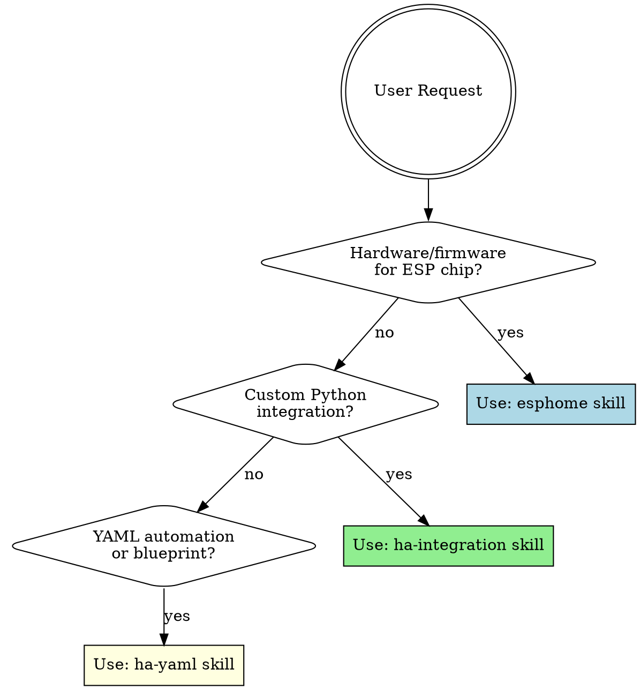

# Skill Integration Guide

How the Aurora Smart Home skills work together.

## The Three Skills

```
┌─────────────────────────────────────────────────────────────────────────┐
│                        Aurora Smart Home Skills                          │
├─────────────────────────────────────────────────────────────────────────┤
│                                                                          │
│  ┌──────────────┐    ┌──────────────────┐    ┌──────────────────┐       │
│  │   ESPHome    │    │  HA Integration  │    │   HA Automation  │       │
│  │   (esphome)  │    │ (ha-integration) │    │    (ha-yaml)     │       │
│  ├──────────────┤    ├──────────────────┤    ├──────────────────┤       │
│  │ ESP32/ESP8266│    │  Python code     │    │  YAML config     │       │
│  │ firmware     │    │  custom_comp     │    │  automations     │       │
│  │ .yaml config │    │  .py files       │    │  scripts/scenes  │       │
│  └──────────────┘    └──────────────────┘    └──────────────────┘       │
│                                                                          │
└─────────────────────────────────────────────────────────────────────────┘
```

## Decision Flow



## When to Use Each Skill

### ESPHome Skill (`esphome`)

**Use for:**
- ESP32, ESP8266, ESP32-S3, ESP32-C6 firmware
- Sensor configurations (temperature, humidity, motion, etc.)
- Smart plugs and switches
- LED strips and lights
- Voice assistants (Micro Wake Word)
- Matter/Thread devices
- BLE Proxy for Bluetooth range extension

**Symptoms in user request:**
- "ESP32", "ESP8266", "ESPHome"
- "GPIO", "pin", "flash", "compile"
- "sensor yaml", "esphome config"
- "Shelly", "Sonoff", "Tuya" (for ESPHome conversion)

**Output:** `.yaml` files for ESPHome

---

### HA Integration Skill (`ha-integration`)

**Use for:**
- Custom Python integrations for Home Assistant
- Cloud API integrations (REST, OAuth2)
- Local device integrations (serial, TCP)
- Custom entity types
- DataUpdateCoordinator patterns
- Conversation agents for voice control
- HACS-ready integrations

**Symptoms in user request:**
- "custom_components", "custom integration"
- "Python", "coordinator", "config_flow"
- "API integration", "cloud service"
- "HACS", "publish integration"

**Output:** Python files in `custom_components/` structure

---

### HA Automation Skill (`ha-yaml`)

**Use for:**
- Automations (if-this-then-that)
- Scripts (reusable action sequences)
- Blueprints (shareable automation templates)
- Scenes (predefined states)
- Template sensors
- Dashboard configurations
- Voice Assist custom sentences

**Symptoms in user request:**
- "automation", "trigger", "action"
- "blueprint", "template"
- "when X happens, do Y"
- "dashboard", "lovelace", "card"

**Output:** `.yaml` files for Home Assistant configuration

## Common Workflows

### Workflow 1: New Sensor Device

```
User: "I want to create a temperature sensor with ESP32"

┌──────────────────────────────────────────────────────────────┐
│ Step 1: esphome skill                                        │
│ ─────────────────────                                        │
│ • Confirm board (ESP32-DevKit, ESP32-S3, etc.)               │
│ • Generate sensor configuration (.yaml)                      │
│ • Flash to device                                            │
└──────────────────────────────────────────────────────────────┘
                              ↓
┌──────────────────────────────────────────────────────────────┐
│ Step 2: Home Assistant                                       │
│ ──────────────────────                                       │
│ • Device auto-discovered via ESPHome integration             │
│ • Entities created (sensor.temperature, etc.)                │
└──────────────────────────────────────────────────────────────┘
                              ↓
┌──────────────────────────────────────────────────────────────┐
│ Step 3: ha-yaml skill (optional)                             │
│ ────────────────────────────────                             │
│ • Create automations using the new sensor                    │
│ • Example: "Turn on heater when temperature < 18°C"          │
└──────────────────────────────────────────────────────────────┘
```

### Workflow 2: Cloud API Integration

```
User: "I want to integrate my Acme Smart Thermostat cloud API"

┌──────────────────────────────────────────────────────────────┐
│ Step 1: ha-integration skill                                 │
│ ────────────────────────────                                 │
│ • Clarify: API type (REST/GraphQL), auth (OAuth2/API key)    │
│ • Generate custom_components/ structure                      │
│ • Create coordinator, config_flow, entities                  │
│ • Optional: HACS preparation                                 │
└──────────────────────────────────────────────────────────────┘
                              ↓
┌──────────────────────────────────────────────────────────────┐
│ Step 2: Home Assistant                                       │
│ ──────────────────────                                       │
│ • Install integration (copy to custom_components/ or HACS)   │
│ • Configure via UI (Settings → Integrations)                 │
│ • Entities created (climate.acme_thermostat, etc.)           │
└──────────────────────────────────────────────────────────────┘
                              ↓
┌──────────────────────────────────────────────────────────────┐
│ Step 3: ha-yaml skill (optional)                             │
│ ────────────────────────────────                             │
│ • Create automations using the new entities                  │
│ • Create dashboard cards for the thermostat                  │
└──────────────────────────────────────────────────────────────┘
```

### Workflow 3: Voice Assistant

```
User: "I want voice control for my smart home"

┌──────────────────────────────────────────────────────────────┐
│ Option A: Local Voice (esphome skill)                        │
│ ─────────────────────────────────────                        │
│ • ESP32-S3 with microphone/speaker                           │
│ • Micro Wake Word for on-device detection                    │
│ • Connects to Home Assistant Assist                          │
│ → Use esphome skill for device firmware                      │
└──────────────────────────────────────────────────────────────┘

┌──────────────────────────────────────────────────────────────┐
│ Option B: Custom Voice Agent (ha-integration skill)          │
│ ──────────────────────────────────────────────               │
│ • ConversationEntity for LLM integration                     │
│ • Custom intent handling                                     │
│ • Advanced NLU processing                                    │
│ → Use ha-integration skill for Python code                   │
└──────────────────────────────────────────────────────────────┘

┌──────────────────────────────────────────────────────────────┐
│ Option C: Custom Sentences (ha-yaml skill)                   │
│ ─────────────────────────────────────────                    │
│ • Custom sentences for Assist                                │
│ • Intent scripts                                             │
│ • Response templates                                         │
│ → Use ha-yaml skill for YAML configuration                   │
└──────────────────────────────────────────────────────────────┘
```

### Workflow 4: Matter Device

```
User: "I want my ESP32 device to work with Apple Home"

┌──────────────────────────────────────────────────────────────┐
│ Step 1: esphome skill                                        │
│ ─────────────────────                                        │
│ • Use ESP32-C6 (recommended for Matter + Thread)             │
│ • Enable Matter in configuration                             │
│ • Set device_type (light, plug, sensor, etc.)                │
│ • Generate matter-enabled config                             │
└──────────────────────────────────────────────────────────────┘
                              ↓
┌──────────────────────────────────────────────────────────────┐
│ Step 2: Pairing                                              │
│ ────────────                                                 │
│ • Scan QR code from ESPHome logs                             │
│ • Add to Apple Home / Google Home / Alexa                    │
│ • Device appears in multiple ecosystems                      │
└──────────────────────────────────────────────────────────────┘
```

## Cross-Skill References

| Scenario | Primary Skill | Reference File |
|----------|--------------|----------------|
| ESPHome sensor → HA automation | ha-yaml | `references/integrations-esphome.md` |
| Cloud API → custom integration | ha-integration | `references/api-integration.md` |
| Voice assistant hardware | esphome | `references/voice-local.md` |
| Voice assistant Python | ha-integration | `references/conversation-agent.md` |
| Voice custom sentences | ha-yaml | `references/assist-patterns.md` |
| BLE Proxy → presence detection | esphome + ha-yaml | `references/ble-proxy.md`, `references/presence-detection.md` |
| Matter device | esphome | `references/matter-bridge.md` |
| Multi-coordinator integration | ha-integration | `references/multi-coordinator.md` |
| Notification patterns | ha-yaml | `references/notification-patterns.md` |
| Calendar automations | ha-yaml | `references/calendar-automation.md` |

## Skill Combination Examples

### BLE Presence Detection

1. **esphome**: Create BLE Proxy (`ble-proxy.yaml` template)
2. **ha-yaml**: Create presence automation (`presence-detection.md` reference)

### Smart Thermostat with Scheduling

1. **esphome**: ESP32 with temperature sensor + relay
2. **ha-yaml**: Climate schedule automation (`automation-climate-schedule.yaml` template)
3. **ha-yaml**: Calendar-based schedule (`calendar-automation.md` reference)

### Custom Cloud Service

1. **ha-integration**: Create custom integration with DataUpdateCoordinator
2. **ha-yaml**: Create automations for the new entities
3. **ha-yaml**: Create dashboard cards

## Iron Laws Summary

Each skill has a non-negotiable rule:

| Skill | Iron Law |
|-------|----------|
| esphome | `CONFIRM BOARD BEFORE GENERATING ANY CONFIGURATION` |
| ha-integration | `TIMESTAMPS: dt_util.now()` / `ATTRIBUTES: JSON-SERIALIZABLE` / `ASYNC: aiohttp` |
| ha-yaml | `CLARIFY INTENT BEFORE GENERATING ANY YAML` |

## Quick Selection Guide

| User Says | Skill |
|-----------|-------|
| "ESP32", "flash", "GPIO" | esphome |
| "custom integration", "Python", "HACS" | ha-integration |
| "automation", "blueprint", "trigger" | ha-yaml |
| "dashboard", "lovelace", "card" | ha-yaml |
| "voice assistant hardware" | esphome |
| "conversation agent", "LLM" | ha-integration |
| "custom sentences", "Assist" | ha-yaml |
| "Matter", "Thread", "Apple Home" | esphome |
| "coordinator", "config_flow" | ha-integration |
| "scene", "script", "template sensor" | ha-yaml |

---

*Generated with [aurora-smart-home](https://github.com/tonylofgren/aurora-smart-home)*
